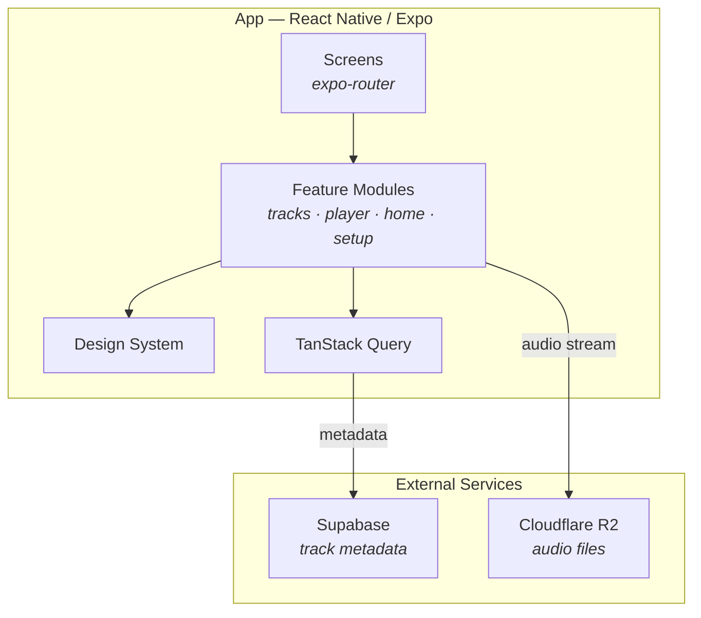
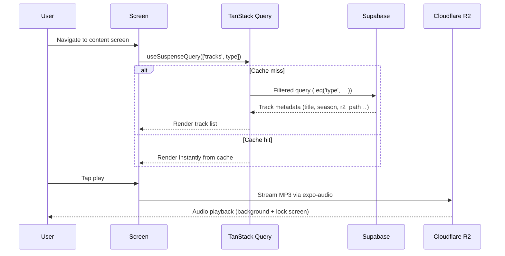

# Donjon de Naheulbeuk — Mobile Streaming App

## Project Overview

A mobile audio streaming app for listening to the _Donjon de Naheulbeuk_ audio saga (by Pen of Chaos). The app serves episodes by season, bonus content, songs, and a soundboard — all streamed from cloud storage.

---

## Tech Stack

| Layer            | Technology                                       |
| ---------------- | ------------------------------------------------ |
| Mobile framework | React Native 0.83 + Expo SDK 55 (managed)        |
| Package manager  | Yarn 4                                           |
| Navigation       | `expo-router` (file-based, Stack layout)         |
| Audio playback   | `expo-audio` (background + lock screen support)  |
| Data fetching    | TanStack Query                                   |
| Validation       | Zod                                              |
| Supabase client  | `@supabase/supabase-js`                          |
| Backend / Auth   | Supabase (Postgres + Auth)                       |
| Audio storage    | Cloudflare R2 (S3-compatible)                    |
| Testing          | Jest + jest-expo + @testing-library/react-native |
| Linting          | ESLint (flat config) + @bam.tech/eslint-plugin   |
| Formatting       | Prettier                                         |

---

## Project Structure

```
src/
  app/
    navigation/              # expo-router root (file-based routing)
      _layout.tsx            # Root Stack layout
      index.tsx              # Home screen
      setup.tsx              # Setup screen
      tracks/
        bonus.tsx            # Bonus content screen
        songs.tsx            # Songs screen
        season/
          [season].tsx       # Dynamic season screen
  modules/
    home/screens/            # Home screen module
    tracks/                  # Tracks feature module
      api/                   #   Supabase queries
      types/                 #   TypeScript types
      domain/                #   Business logic
      hooks/                 #   Data fetching hooks
      components/            #   Presentational components
      screens/               #   Screen components
      mocks/                 #   Test fixtures
    player/                  # Audio player module
      context/               #   Player state context
      hooks/                 #   Playback hooks
      components/            #   Player UI components
    setup/screens/           # Setup screen module
  shared/
    appEnv.ts                # Typed runtime config from app.config.ts
    supabase.ts              # Supabase client
    r2Url.ts                 # R2 URL builder
    i18n/                    # Lingui i18n setup + locales
    QueryErrorBoundary.tsx   # Suspense + error boundary wrapper
  design-system/
    theme.ts                 # Theme tokens (colors, spacing, fonts)
    Button.tsx               # Button component
    IconButton.tsx           # Icon button component
    Typography.tsx           # Text components
    WoodenView.tsx           # Themed container
  testing/                   # Test utilities and setup
  types/                     # Global type declarations
```

**Path aliases** (configured in `tsconfig.json`):

| Alias              | Path                  |
| ------------------ | --------------------- |
| `#app/*`           | `src/app/*`           |
| `#modules/*`       | `src/modules/*`       |
| `#shared/*`        | `src/shared/*`        |
| `#design-system/*` | `src/design-system/*` |
| `#testing/*`       | `src/testing/*`       |

---

## Configuration

Runtime configuration is managed in `app.config.ts`, **not** via `.env` files for app secrets. The `STAGE` environment variable (`dev` | `staging` | `production`) selects the config:

```ts
// app.config.ts — each stage defines its own appEnv
appEnv: {
  apiUrl: "https://staging.myapi.com",
  flags: {},
}
```

Config is accessed at runtime via `expo-constants`:

```ts
// src/shared/appEnv.ts
import Constants from "expo-constants";
export const appEnv = Constants.expoConfig?.extra?.["appEnv"];
```

The `.env` file only contains Expo tooling flags (e.g. `EXPO_NO_CLIENT_ENV_VARS`).

---

## Architecture Overview



### Data flow



**Key points:**

- No data fetched on app launch — the home screen is static
- Fetching is lazy, triggered only when navigating to a content screen
- Audio streams directly from R2 — Supabase never handles audio data
- Soundboard clips are fire-and-forget (no queue, can overlap with the main player)

---

## Data Model

### Single table: `tracks`

| Column           | Type      | Nullable | Notes                                                   |
| ---------------- | --------- | -------- | ------------------------------------------------------- |
| `id`             | uuid      | no       | Primary key, default `gen_random_uuid()`                |
| `type`           | text      | no       | `episode` · `bonus` · `song` · `soundboard`             |
| `title`          | text      | no       | Display title                                           |
| `season`         | integer   | yes      | Season number (null for bonus/song/sound)               |
| `episode_number` | integer   | yes      | Global episode number (null if N/A)                     |
| `part_number`    | integer   | yes      | Part number for multi-part episodes (null if single)    |
| `r2_path`        | text      | no       | Relative path to MP3 on R2 (e.g. `episodes/s01e01.mp3`) |
| `created_at`     | timestamp | no       | Default `now()`                                         |

**Constraints:**

- `type` is checked against allowed values (`episode`, `bonus`, `song`, `soundboard`)
- `(season, episode_number, part_number)` is unique
- Index on `type` for filtered queries

**Note:** `r2_path` stores the relative path only. The full URL is constructed in the app using `appEnv.r2BaseUrl` + `r2_path`, allowing dev and production to use different R2 domains.

---

## Business Rules

### Content types

1. **Episodes** — belong to a season, ordered by episode number. Displayed grouped by season. Sequential listening (play next episode automatically).
2. **Bonus** — standalone audio not attached to a season. Displayed as a flat list.
3. **Songs** — music tracks from the saga. Flat list.
4. **Soundboard** — short audio clips. Grid layout. Tap to play immediately (no queue, no "now playing" bar).

### Playback rules

- Episodes, bonus, and songs use the **main player** — one audio playing at a time, with play/pause/seek/skip controls and a persistent mini-player bar.
- Soundboard clips are **fire-and-forget** — tap plays the sound immediately, potentially overlapping with the main player or other soundboard clips. No seek, no queue.
- Background audio playback should be supported for the main player (episodes/bonus/songs).
- Lock screen / notification controls for the main player only.

### Fetching rules

- Data is **never** fetched on app launch. The home screen is static (navigation only).
- Fetching happens **lazily** — only when the user navigates to a content screen.
- Each screen fetches only its content type via a filtered Supabase query.
- TanStack Query handles caching, deduplication, and stale-while-revalidate.
- Loading and error states are handled via **React Suspense** and **Error Boundaries**, not manual `isLoading` / `isError` checks. TanStack Query hooks use the `useSuspenseQuery` variant.

---

## App Screens

| Screen         | Content                    | Layout                                |
| -------------- | -------------------------- | ------------------------------------- |
| **Episodes**   | Episodes grouped by season | Section list, collapsible seasons     |
| **Bonus**      | Bonus episodes             | Flat list, optional category grouping |
| **Chansons**   | Songs                      | Flat list                             |
| **Soundboard** | Short audio clips          | Grid of tappable buttons              |

Navigation: **Stack-based**. Home screen with cards linking to each section; each section is pushed onto the stack.

A persistent **mini-player bar** sits at the bottom of the screen when an episode/bonus/song is playing. Tapping it opens a full-screen player with artwork, seek bar, and controls.

---

## Cloudflare R2 Setup

- **Bucket:** public, with a custom domain or R2.dev subdomain
- **Structure:** `naheulbeuk/episodes/s01e01.mp3`, `naheulbeuk/soundboard/nain-miches.mp3`, etc.
- **CORS:** allow `*` (or restrict to your app's origin if using web builds)
- **Free tier:** 10 GB storage, 10 million reads/month, zero egress fees

---

## Out of Scope (v1)

- User authentication / accounts
- Offline downloads / caching MP3s locally
- Playlists or custom queues
- Audio visualizations
- Social features (sharing, comments)
- Push notifications
- Search within episodes

---

## Summary

The app is intentionally simple: one Supabase table, four filtered queries, four screens, and direct R2 streaming. TanStack Query provides caching so the app feels instant after the first load. The Supabase JS client gives you a typed query builder with built-in auth support if you ever need it. The soundboard is the only playback behavior that differs — fire-and-forget instead of the shared player. Everything else is a list of tracks with a play button.
