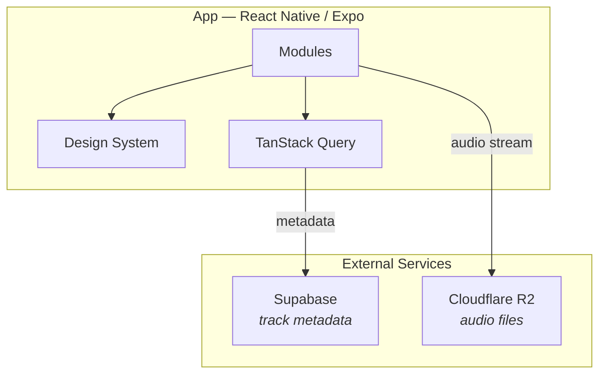
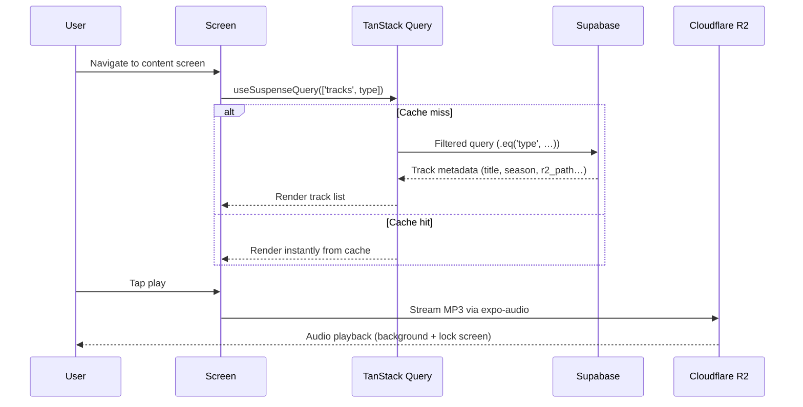
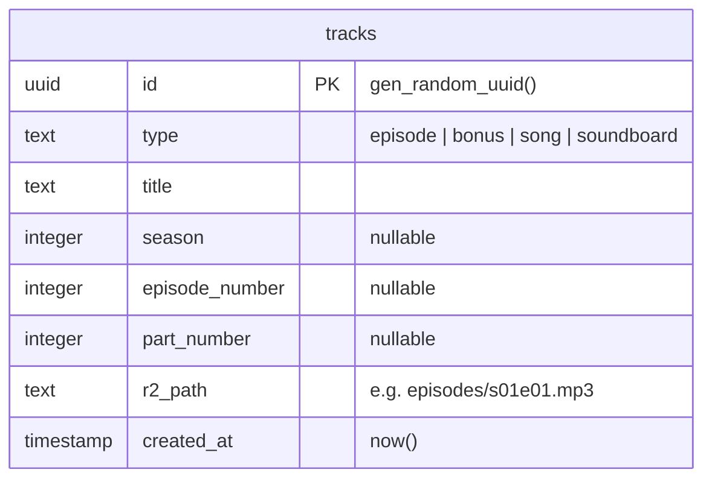

# Donjon de Naheulbeuk — Mobile Streaming App

## Project Overview

A mobile audio streaming app for listening to the _Donjon de Naheulbeuk_ audio saga (by Pen of Chaos). The app serves episodes by season, bonus content, songs, and a soundboard — all streamed from cloud storage.

---

## Tech Stack

| Layer            | Technology                                      |
| ---------------- | ----------------------------------------------- |
| Mobile framework | React Native 0.83 + React 19 + Expo SDK 55 (managed) |
| Package manager  | Yarn 4                                          |
| Navigation       | `expo-router` (file-based, Stack layout)        |
| Audio playback   | `expo-audio` (background + lock screen support) |
| Data fetching    | TanStack Query                                  |
| Validation       | Zod                                             |
| Backend / Auth   | Supabase (Postgres)                             |
| Audio storage    | Cloudflare R2 (S3-compatible)                   |

---

## Configuration

Runtime configuration is managed in `app.config.ts`, **not** via `.env` files for app secrets. The `STAGE` environment variable (`dev` | `staging` | `production`) selects the config:

```ts
// app.config.ts — each stage defines its own appEnv
appEnv: {
  apiUrl: "https://staging.myapi.com",
  flags: {},
}
```

Config is accessed at runtime via `expo-constants`:

```ts
// src/shared/appEnv.ts
import Constants from "expo-constants";
export const appEnv = Constants.expoConfig?.extra?.["appEnv"];
```

The `.env` file only contains Expo tooling flags (e.g. `EXPO_NO_CLIENT_ENV_VARS`).

---

## Architecture Overview



### Data flow



**Key points:**

- No data fetched on app launch — the home screen is static
- Fetching is lazy, triggered only when navigating to a content screen
- Audio streams directly from R2 — Supabase never handles audio data
- Soundboard clips are fire-and-forget (no queue, can overlap with the main player)

---

## Data Model



**Constraints:**

- `type` is checked against allowed values (`episode`, `bonus`, `song`, `soundboard`)
- `(season, episode_number, part_number)` is unique
- Index on `type` for filtered queries

**Note:** `r2_path` stores the relative path only. The full URL is constructed in the app using `appEnv.r2BaseUrl` + `r2_path`, allowing dev and production to use different R2 domains.

---

## Business Rules

### Content types

1. **Episodes** — belong to a season, ordered by episode number. Displayed grouped by season. Sequential listening (play next episode automatically).
2. **Bonus** — standalone audio not attached to a season. Displayed as a flat list.
3. **Songs** — music tracks from the saga. Flat list.
4. **Soundboard** — short audio clips. Grid layout. Tap to play immediately (no queue, no "now playing" bar).

### Playback rules

- Episodes, bonus, and songs use the **main player** — one audio playing at a time, with play/pause/seek/skip controls and a persistent mini-player bar. See [`player.md`](player.md) for the player module structure and [`progress-bar.md`](progress-bar.md) for seek & progress bar details.
- Soundboard clips are **fire-and-forget** — tap plays the sound immediately, potentially overlapping with the main player or other soundboard clips. No seek, no queue.
- Background audio playback should be supported for the main player (episodes/bonus/songs).
- Lock screen / notification controls for the main player only.

### Fetching rules

- Data is **never** fetched on app launch. The home screen is static (navigation only).
- Fetching happens **lazily** — only when the user navigates to a content screen.
- Each screen fetches only its content type via a filtered Supabase query.
- TanStack Query handles caching, deduplication, and stale-while-revalidate.
- Loading and error states are handled via **React Suspense** and **Error Boundaries**, not manual `isLoading` / `isError` checks. TanStack Query hooks use the `useSuspenseQuery` variant.

---

## Cloudflare R2 Setup

- **Bucket:** public, with a custom domain or R2.dev subdomain
- **Structure:** `naheulbeuk/episodes/s01e01.mp3`, `naheulbeuk/soundboard/nain-miches.mp3`, etc.
- **CORS:** allow `*` (or restrict to your app's origin if using web builds)
- **Free tier:** 10 GB storage, 10 million reads/month, zero egress fees
